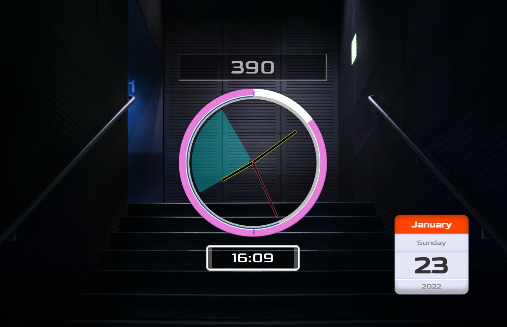

# [Clock](https://michal-w-dev.github.io/Clock/)

## About the App

Clock with animated SVGs. 

User can set countdown in minutes which will be shown graphically on the clock.

SVG countdown can change into showing hours, minutes or seconds depending on how many minutes of the countdown left.

To use countdown - enter value in 'Timer' input and confirm with 'Enter'.

## App development

App was built using `JavaScript Classes`.

## Images

#
